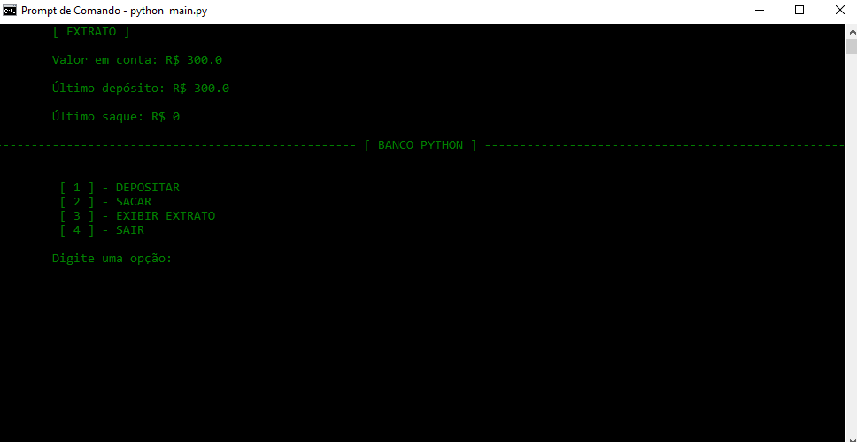

# Sistema Bancário em Python
Implementação de sistema bancário simples em python. [[Desafio de Código - DIO]](https://www.dio.me)

O sistema foi implementado oara rodar em console. Para usá-lo basta apenas baixar o repositório e na pasta do repositório rodar

- ``` python main.py ```



